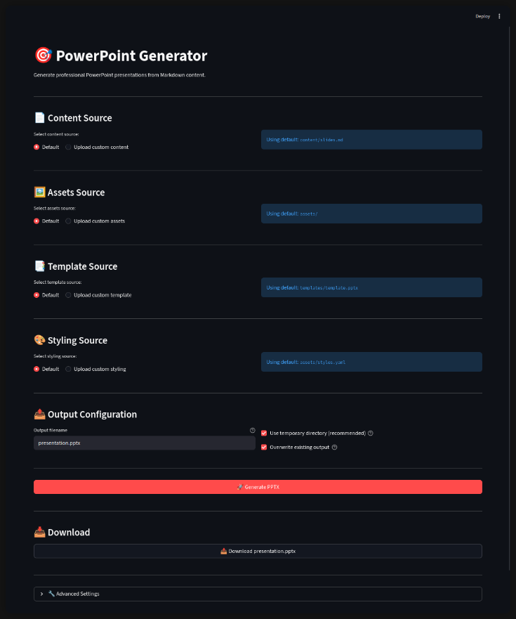

# ILTCI Presentation Generator

[](https://www.python.org/downloads/)
[](LICENSE.md)
[](https://github.com/astral-sh/uv)

A Python-based Markdown-to-PPTX generator with a Streamlit UI, featuring the ILTCI theme. Write your presentation content in Markdown and generate professionally styled PowerPoint presentations with YAML-driven styling overrides.


## Project Overview

This tool allows you to:
- Write presentation content in Markdown with per-slide YAML frontmatter for layout control
- Use **any PowerPoint template** (`.pptx` or `.potx`) — layouts are discovered dynamically by name
- Apply content to professionally designed PowerPoint templates
- Preserve all template styling, backgrounds, and images
- Customize fonts, formatting, spacing, and image styles via YAML overrides
- Generate presentations through a **Streamlit web UI** or **CLI**

The generator parses Markdown files with YAML frontmatter per slide, maps content to template layouts by name, and supports generic placeholder resolution for maximum template compatibility.

## Key Features

| Feature | Description |
|---------|-------------|
| **YAML-Driven Styling** | Fonts, formatting, spacing, and image styles controlled via [`configs/style-overrides.yaml`](configs/style-overrides.yaml) |
| **Streamlit Web UI** | Interactive browser-based interface for configuration and generation |
| **CLI Support** | Command-line interface with config-file and flag-based overrides |
| **Modular App Architecture** | Streamlit app split into components, services, and utilities |
| **Per-Layout Font Control** | Font sizes and formatting configurable per template layout |
| **Image Styling** | Per-image-source border, rounded corner, and caption overrides |
| **Generic Template Support** | Works with any `.pptx`/`.potx` template via dynamic layout discovery |
| **Template Preservation** | Maintains template backgrounds, images, and styling |

## Directory Structure

```
2026 ILTCI/
├── app/                              # Streamlit UI application
│   ├── app.py                        # Streamlit app entrypoint
│   ├── bootstrap.py                  # App initialization and page config
│   ├── config_loader.py              # Configuration loading utilities
│   ├── constants.py                  # Constants, paths, session keys
│   ├── state.py                      # Session state management (typed dataclasses)
│   ├── README.md                     # App-specific usage guide
│   ├── components/                   # UI components
│   │   ├── advanced_settings.py      # Logging and path settings
│   │   ├── assets_source.py          # Custom asset uploads
│   │   ├── content_source.py         # Content file selection
│   │   ├── download_section.py       # Download generated file
│   │   ├── generate_button.py        # Generate button and logic
│   │   ├── output_config.py          # Output filename/options
│   │   ├── style_overrides.py        # Style override mode selection
│   │   └── template_source.py        # Template source selection
│   ├── services/                     # Business logic
│   │   ├── assets_service.py         # Asset file handling
│   │   └── generation_service.py     # Presentation generation orchestration
│   └── utils/                        # Pure utility functions
│       └── fs_safety.py              # Filename validation, path safety
├── src/                              # Core Python library
│   ├── generate_pptx.py              # Thin CLI wrapper script
│   └── iltci_pptx/                   # Core package
│       ├── __init__.py               # Package exports
│       ├── cli.py                    # Command-line interface
│       ├── config.py                 # Configuration management and merging
│       ├── generator.py              # Presentation orchestration
│       ├── markdown_parser.py        # Markdown parsing logic
│       ├── slide_builders.py         # Slide construction
│       ├── rich_text.py              # Text formatting (bold, italic, code)
│       ├── html_media.py             # HTML and image extraction
│       ├── images.py                 # Image handling and styling
│       ├── layout_discovery.py       # Template layout discovery & registry
│       └── placeholder_resolver.py   # Generic placeholder resolution
├── configs/                          # Configuration files
│   ├── config.yaml                   # Main runtime configuration
│   └── style-overrides.yaml          # Styling overrides (fonts, formatting, images)
├── templates/                        # PowerPoint templates
│   └── template.potx                 # Base POTX template with ILTCI styling
├── content/                          # Markdown content files
│   └── slides.md                     # Presentation slide content
├── assets/                           # Static resources (images for slides)
│   └── *.png                         # Slide images
├── pyproject.toml                    # Project configuration and dependencies
├── uv.lock                           # Locked dependencies (uv)
├── CONTRIBUTING.md                   # Contribution guidelines
├── LICENSE.md                        # MIT License
├── .gitignore                        # Git ignore rules
└── README.md                         # This file
```

## Installation

### Prerequisites

- Python 3.8 or higher
- [`uv`](https://github.com/astral-sh/uv) (recommended) or `pip`

### Quick Install

```bash
# Clone the repository
git clone <repository-url>
cd "2026 ILTCI"

# Option 1: Using uv (recommended)
uv sync

# Option 2: Using pip
python -m venv .venv
source .venv/bin/activate  # Windows: .venv\Scripts\activate
pip install -e .
```

For detailed installation instructions, see [`docs/INSTALLATION.md`](docs/INSTALLATION.md).

## Quick Start

### Streamlit Web UI

Launch the interactive web interface:

```bash
uv run streamlit run app/app.py
```

Then open your browser to `http://localhost:8501`.



The UI allows you to:
- Select or upload content, templates, and assets
- Configure style overrides
- Set output filename and options
- Generate and download the PPTX

See [`app/README.md`](app/README.md) for full app documentation.

### Command-Line Interface

**View CLI help:**

```bash
uv run python src/generate_pptx.py --help
```

**Generate a presentation (using defaults from config):**

```bash
uv run python src/generate_pptx.py
```

**With custom options:**

```bash
uv run python src/generate_pptx.py \
  --config configs/config.yaml \
  --template templates/template.potx \
  --content content/slides.md \
  --output output/presentation.pptx \
  --assets-dir assets/
```

### CLI Reference

| Option | Description | Default |
|--------|-------------|---------|
| `--config` | Path to configuration YAML | `app/config.yaml` |
| `--template` | Path to PowerPoint template (overrides config) | — |
| `--content` | Path to Markdown content file (overrides config) | — |
| `--output` | Output PPTX file path (overrides config) | — |
| `--assets-dir` | Path to assets directory (overrides config) | — |

## Markdown Content Format

Create slides using Markdown with `---` separators and per-slide YAML frontmatter:

```markdown
---
title: "AI for Actuaries"
author: "Chris Nienart"
date: "2026-03-10"
template: templates/template.potx
---

---
layout: Title
---

# Main Title

## Subtitle

Speaker Name

Date

---

---
layout: Text
---

# Content Slide

- First bullet point
- Second bullet point
  - Sub-bullet (indent with 2 spaces)
- Third bullet point

---

---
layout: Image Right
images:
  - src: example-image.png
    data-caption: "Caption text"
---

# Slide with Image

Body text content here.

---

---
layout: Dual Image
images:
  - src: image-left.png
    data-caption: "Left caption"
  - src: image-right.png
    data-caption: "Right caption"
---

# Two Images

Comparison slide with dual images.
```

### Slide Layouts

Layouts are discovered dynamically from the template. The default ILTCI template ([`templates/template.potx`](templates/template.potx)) provides:

| Layout | Description |
|--------|-------------|
| `Title` | Title slide with section name, title, and subtitle |
| `Text` | Standard content slide with title and body |
| `Image Right` | Content slide with an image on the right |
| `Dual Image` | Slide with two side-by-side images |

Set the layout per slide using `layout:` in the YAML frontmatter block.

### Image Syntax

Images are specified in the frontmatter `images:` array:

```yaml
images:
  - src: filename.png
    data-caption: "Optional caption"
```

Image files are resolved relative to the configured assets directory ([`assets/`](assets/) by default).

## Configuration

### [`configs/config.yaml`](configs/config.yaml) — Runtime Configuration

```yaml
paths:
  project_root: ".."
  template: "templates/template.potx"
  styles_overrides: "configs/style-overrides.yaml"
  content: "content/slides.md"
  assets_dir: "assets/"
  output: "output/presentation.pptx"

settings:
  overwrite_output: true
  logging:
    level: "INFO"

ui:
  page:
    title: "ILTCI PPTX Generator"
    layout: "wide"
  defaults:
    output_filename: "presentation.pptx"
    use_temp_output: true
  advanced:
    show_template_paths: false
  style_overrides_mode: "default"
```

Paths are resolved relative to `project_root` (which is itself relative to the config file's directory).

### [`configs/style-overrides.yaml`](configs/style-overrides.yaml) — Styling Overrides

This file controls fonts, formatting, spacing, and image styles. Overrides are applied on top of the base configuration with highest precedence.

**Sections:**

| Section | Controls |
|---------|----------|
| `fonts` | Font sizes per layout (`title`, `text`, `image_right`, `dual_image`) |
| `formatting` | Bold settings per layout and heading level |
| `spacing` | Line spacing and paragraph spacing per layout |
| `image_styles` | Per-image-source overrides for borders and rounded corners |

**Example — Adjust title slide fonts:**

```yaml
fonts:
  title:
    section_name_pt: 40
    title_pt: 50
    subtitle_h2_pt: 32
```

**Example — Per-image style override:**

```yaml
image_styles:
  per_image_src:
    git-jj.png:
      border_enabled: false
      rounded_enabled: false
```

### Configuration Merge Order

The [`Config`](src/iltci_pptx/config.py) class loads and merges configuration in this order (each layer overrides the previous):

1. **Template config** (base, if specified)
2. **Main config** ([`configs/config.yaml`](configs/config.yaml))
3. **Style overrides** ([`configs/style-overrides.yaml`](configs/style-overrides.yaml)) — highest precedence

## Architecture

### Core Library (`src/iltci_pptx/`)

| Module | Responsibility |
|--------|---------------|
| [`cli.py`](src/iltci_pptx/cli.py) | Command-line argument parsing and entry point |
| [`config.py`](src/iltci_pptx/config.py) | YAML config loading, merging, path resolution |
| [`generator.py`](src/iltci_pptx/generator.py) | Orchestrates end-to-end presentation generation |
| [`markdown_parser.py`](src/iltci_pptx/markdown_parser.py) | Parses Markdown with YAML frontmatter into slide data |
| [`slide_builders.py`](src/iltci_pptx/slide_builders.py) | Constructs slides from parsed data using template layouts |
| [`rich_text.py`](src/iltci_pptx/rich_text.py) | Rich text formatting (bold, italic, inline code) |
| [`html_media.py`](src/iltci_pptx/html_media.py) | HTML tag extraction and media handling |
| [`images.py`](src/iltci_pptx/images.py) | Image placement, styling, placeholder filling |
| [`layout_discovery.py`](src/iltci_pptx/layout_discovery.py) | Discovers layouts from templates, builds name→index registry |
| [`placeholder_resolver.py`](src/iltci_pptx/placeholder_resolver.py) | Resolves placeholders by type, name, or index |

### Streamlit App (`app/`)

The app follows a modular architecture with separated concerns:

- **[`app.py`](app/app.py)** — Thin orchestrator entrypoint
- **[`bootstrap.py`](app/bootstrap.py)** — Initialization, path setup, page config
- **[`constants.py`](app/constants.py)** — All constants (paths, extensions, session keys)
- **[`config_loader.py`](app/config_loader.py)** — YAML configuration loading
- **[`state.py`](app/state.py)** — Typed dataclasses and session state wrappers
- **Components** (`app/components/`) — UI sections (content, template, assets, output, etc.)
- **Services** (`app/services/`) — Business logic (asset handling, generation)
- **Utilities** (`app/utils/`) — Pure functions (filename validation, path safety)

See [`app/README.md`](app/README.md) for the full module breakdown.

## Documentation

| Document | Description |
|----------|-------------|
| [`README.md`](README.md) | This file |
| [`app/README.md`](app/README.md) | Streamlit app architecture and usage |

## Troubleshooting

| Issue | Solution |
|-------|----------|
| `Configuration file not found` | Ensure [`configs/config.yaml`](configs/config.yaml) exists or specify with `--config` |
| `Template file not found` | Verify template path in config or use `--template` |
| `Required files not found` | Check that both template and content paths resolve correctly |
| Slides not formatted correctly | Check Markdown syntax — especially `---` separators and frontmatter blocks |
| Images not appearing | Verify image filenames in `images:` frontmatter match files in the assets directory |
| Image styles not applied | Check [`configs/style-overrides.yaml`](configs/style-overrides.yaml) `image_styles.per_image_src` section |

## Dependencies

- **[python-pptx](https://python-pptx.readthedocs.io/)** (>=0.6.21) — PowerPoint file creation
- **[PyYAML](https://pyyaml.org/)** (>=6.0) — YAML configuration parsing
- **[Streamlit](https://streamlit.io/)** (>=1.38.0) — Web UI framework

Dependencies are managed in [`pyproject.toml`](pyproject.toml) and locked in [`uv.lock`](uv.lock).

## Contributing

See [`CONTRIBUTING.md`](CONTRIBUTING.md) for guidelines.

## License

[MIT License](LICENSE.md)

This project is part of the 2026 ILTCI presentation materials.

---

**Last Updated**: February 10, 2026
