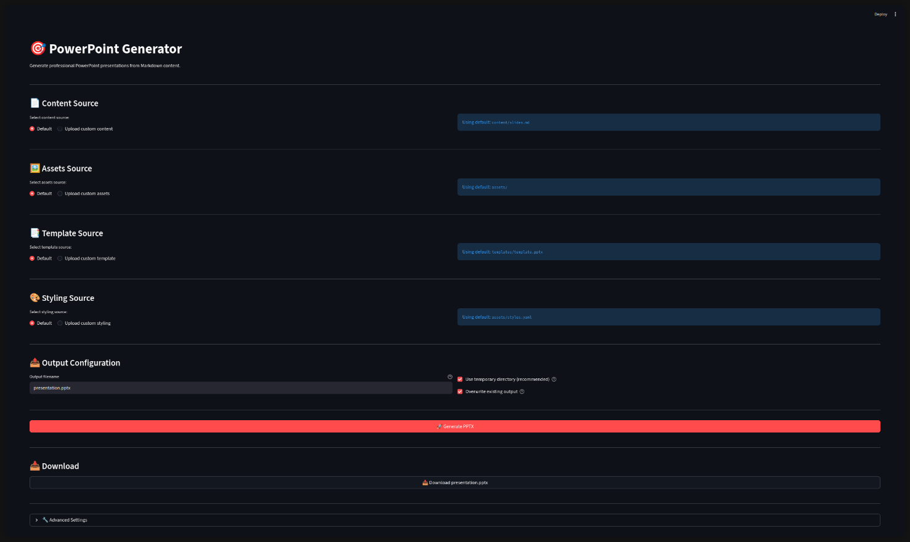

# ILTCI Presentation Generator

A Python-based tool for generating professional PowerPoint presentations from Markdown content using customizable PPTX templates. This project maintains template styling, images, and backgrounds while seamlessly integrating your content.

## Project Overview

This tool allows you to:
- Write presentation content in Markdown format
- Apply content to professionally designed PowerPoint templates
- Preserve all template styling, backgrounds, and images
- Generate presentation slides programmatically
- Maintain consistency across multiple presentations

The generator parses Markdown files with slide separators and intelligently maps content to template layouts, including special handling for title slides, content slides with bullets, and other slide types.

## Directory Structure

```
2026 ILTCI/
├── app/                          # Streamlit UI + default configuration
│   ├── app.py                    # Streamlit app entrypoint
│   ├── config.yaml               # Default configuration (CLI/app)
│   └── README.md                 # App-specific usage (how to run the UI)
├── src/                          # Python source code
│   ├── generate_pptx.py         # Main presentation generator script (thin wrapper)
│   └── iltci_pptx/              # Core package
│       ├── __init__.py          # Package marker
│       ├── cli.py               # Command-line interface
│       ├── config.py            # Configuration management
│       ├── generator.py         # Presentation orchestration
│       ├── markdown_parser.py   # Markdown parsing logic
│       ├── slide_builders.py    # Slide construction
│       ├── rich_text.py         # Text formatting
│       ├── html_media.py        # HTML and image extraction
│       └── images.py            # Image handling
├── content/                      # Markdown content files
│   └── slides.md                # Slide content in Markdown format
├── templates/                    # PowerPoint templates
│   └── template.pptx            # Base presentation template with styling
├── assets/                       # Static resources
│   ├── template-config.yaml     # Template styling configuration
│   ├── layout-specs.yaml        # Layout specifications
│   ├── iltci-theme.css          # Theme styling reference
│   ├── image-layout.css         # Image layout styling
│   ├── streamlit-app.png        # App screenshot
│   └── *.png                    # Various presentation images
├── scripts/                      # Utility scripts
│   ├── add_layouts.py           # Script to add layouts to template
│   └── inspect_template.py      # Script to inspect template structure
├── docs/                         # Documentation
│   ├── INSTALLATION.md          # Installation guide
│   ├── IMAGE_STYLING_GUIDE.md   # Guide for image styling in slides
│   ├── README_STYLING.md        # Styling guidelines
│   └── template_styles_extracted.md  # Template style documentation
├── output/                       # Generated presentations (created on run)
├── pyproject.toml               # Project dependencies
└── README.md                    # This file
```

## Getting Started

### Prerequisites

- Python 3.8 or higher
- One of the following package managers:
  - `uv` (recommended for faster installation)
  - `pip` (standard Python package manager)

### Installation

#### Option 1: Using `uv` (Recommended)

```bash
# Install uv if not already installed
curl -LsSf https://astral.sh/uv/install.sh | sh

# Sync dependencies
uv sync
```

#### Option 2: Using `pip`

```bash
# Create a virtual environment (recommended)
python -m venv .venv
source .venv/bin/activate  # On Windows: .venv\Scripts\activate

# Install dependencies
pip install -r requirements.txt
# Or manually:
pip install python-pptx>=0.6.21 pyyaml>=6.0
```

### Quick Start

1. **Edit your content**: Modify [`content/slides.md`](content/slides.md) with your presentation content
2. **Run the generator**:
   ```bash
   python src/generate_pptx.py
   ```
3. **Find your presentation**: Check [`output/presentation.pptx`](output/presentation.pptx)

## Configuration

The generator uses a two-tier configuration system:

1. **[`app/config.yaml`](app/config.yaml)** - Main configuration for paths and high-level settings
2. **[`assets/template-config.yaml`](assets/template-config.yaml)** - Template-specific styling and formatting

### Main Configuration (`app/config.yaml`)

```yaml
paths:
  # Template PowerPoint file
  template: "templates/template.pptx"
  
  # Template configuration (styling, layout, fonts)
  template_config: "assets/template-config.yaml"
  
  # Content source files
  content: "content/slides.md"
  notes: "content/notes.md"
  
  # Output configuration
  output: "output/presentation.pptx"
  
  # Assets directory
  assets_dir: "assets/"

settings:
  # Overwrite existing output file
  overwrite_output: true
  
  # Logging configuration
  logging:
    level: "INFO"  # DEBUG, INFO, WARNING, ERROR
```

#### Main Configuration Options

- **`paths.template`**: Path to your PowerPoint template file
- **`paths.template_config`**: Path to template styling configuration
- **`paths.content`**: Path to your Markdown content file
- **`paths.notes`**: Path to speaker notes (optional)
- **`paths.output`**: Where the generated presentation will be saved
- **`paths.assets_dir`**: Directory containing images and other assets
- **`settings.overwrite_output`**: Whether to overwrite existing output files
- **`settings.logging.level`**: Logging verbosity (DEBUG, INFO, WARNING, ERROR)

### Template Configuration (`assets/template-config.yaml`)

The template configuration file contains all styling parameters, making it easy to customize the look and feel of your presentations:

```yaml
# Slide layout indices
layouts:
  title_slide_index: 0
  content_slide_index: 1

# Font sizing (in points)
fonts:
  title_slide:
    section_name: 40
    title: 50
    subtitle: 24
  content_slide:
    title: 32
    h2_header: 32
    h3_header: 24
    h4_header: 20
    h5_header: 18
    body_text: 24
    bullet: 24
    numbered: 24

# Image layout (in inches)
image_layout:
  default_height: 3.0
  default_width: 2.5
  gap_between: 0.5
  top_position: 4.0
```

All previously hardcoded values for fonts, spacing, and layout are now configurable through [`assets/template-config.yaml`](assets/template-config.yaml). This allows you to:

- Customize font sizes for different heading levels
- Adjust image positioning and sizing
- Modify slide layout behavior
- Change bullet and numbering styles

To customize styling, simply edit the values in [`assets/template-config.yaml`](assets/template-config.yaml) - no code changes required.

## Usage

### Basic Usage

Generate a presentation using default configuration:

```bash
python src/generate_pptx.py
```

### Using Command-Line Arguments

Override configuration settings via command-line arguments:

```bash
# Use a different config file
python src/generate_pptx.py --config custom_config.yaml

# Override template path
python src/generate_pptx.py --template templates/custom_template.pptx

# Override content file
python src/generate_pptx.py --content content/my_slides.md

# Override output location
python src/generate_pptx.py --output output/my_presentation.pptx

# Combine multiple overrides
python src/generate_pptx.py \
  --template templates/custom_template.pptx \
  --content content/quarterly_report.md \
  --output output/Q4_2026_Report.pptx
```

### Command-Line Options

- `--config PATH`: Path to configuration file (default: `app/config.yaml`)
- `--template PATH`: Path to PowerPoint template (overrides config)
- `--content PATH`: Path to Markdown content file (overrides config)
- `--output PATH`: Path to output PowerPoint file (overrides config)

### Streamlit App (Web UI)



This repository also includes a Streamlit-based UI in [`app/`](app) for interactively configuring and generating presentations.

For how to run the app locally, see [`app/README.md`](app/README.md).

### Markdown Content Format

Create slides in Markdown with slide separators (`---`):

```markdown
---
title: "Your Presentation Title"
author: "Your Name"
date: "2026-01-01"
---

<!-- _class: title -->

### Section Name

# Main Title

## Subtitle Line 1

### Subtitle Line 2

---

# Slide Title

- First bullet point
- Second bullet point
  - Sub-bullet point
- Third bullet point

---

# Another Slide

Content goes here...
```

**Key formatting notes:**
- Use `---` to separate slides
- Use `<!-- _class: title -->` for title slides
- Use `#` for main titles
- Use `##` and `###` for subtitles on title slides
- Use `-` for bullet points
- Indent with two spaces for sub-bullets

## Examples

### Example 1: Simple Presentation

```bash
# Create a basic presentation with default settings
python src/generate_pptx.py
```

### Example 2: Custom Template

```bash
# Use a custom template for a specific client
python src/generate_pptx.py \
  --template templates/client_template.pptx \
  --output output/client_presentation.pptx
```

### Example 3: Multiple Presentations

```bash
# Generate different presentations from different content
python src/generate_pptx.py --content content/intro.md --output output/intro.pptx
python src/generate_pptx.py --content content/advanced.md --output output/advanced.pptx
```

## Documentation

Additional documentation is available in the [`docs/`](docs) directory:

- **[`INSTALLATION.md`](docs/INSTALLATION.md)**: Detailed installation instructions
- **[`IMAGE_STYLING_GUIDE.md`](docs/IMAGE_STYLING_GUIDE.md)**: Guide to image styling in slides
- **[`README_STYLING.md`](docs/README_STYLING.md)**: Guide to styling and customization
- **[`template_styles_extracted.md`](docs/template_styles_extracted.md)**: Template style reference

## Troubleshooting

### Common Issues

**Issue**: `FileNotFoundError: Configuration file not found`
- **Solution**: Ensure [`app/config.yaml`](app/config.yaml) exists or specify the correct path with `--config`

**Issue**: `Template file not found`
- **Solution**: Verify the template path in [`app/config.yaml`](app/config.yaml) or provide the correct path with `--template`

**Issue**: `Content file not found`
- **Solution**: Check that your Markdown file exists at the specified path

**Issue**: Slides not appearing as expected
- **Solution**: Verify your Markdown formatting, especially slide separators (`---`) and heading levels

## Project Dependencies

This project uses the following Python packages:

- **python-pptx** (>=0.6.21): Python library for creating and updating PowerPoint files
- **pyyaml** (>=6.0): YAML parser for configuration files

Dependencies are managed in [`pyproject.toml`](pyproject.toml).

## Contributing

When contributing to this project:

1. Maintain the existing directory structure
2. Update documentation when adding features
3. Test with various markdown formats
4. Preserve template compatibility

See [CONTRIBUTING.md](CONTRIBUTING.md) for more information.

## License

[MIT License](LICENSE.md)

This project is part of the 2026 ILTCI presentation materials.

## Support

For issues or questions:
1. Check the documentation in the [`docs/`](docs) directory
2. Review the example content in [`content/slides.md`](content/slides.md)
3. Verify your configuration in [`app/config.yaml`](app/config.yaml)


---

**Last Updated**: January 22, 2026
